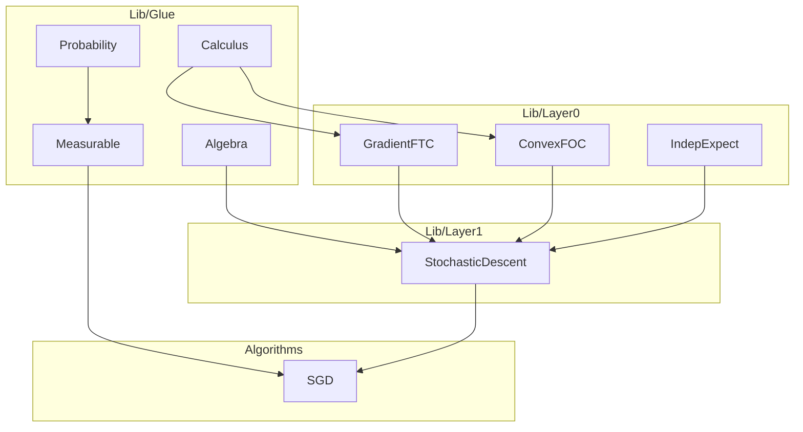

# StochOptLib Methodology

This document records the theoretical methodology behind this library:
how to diagnose missing infrastructure (gap taxonomy), how to probe for
it systematically (Stub-Probe protocol), and how to decide which algorithms
to use as probes.

**See also:**
- `docs/CONVENTIONS.md` — design rules for theorem signatures
- `docs/CATALOG.md` — index of all proved lemmas and their gaps

---

## 1. Gap Taxonomy

When a Lean 4 / Mathlib formalization gets stuck, there are exactly three
root causes. Correctly diagnosing the cause determines the fix strategy.

| Type | True cause | Common misdiagnosis |
|------|-----------|---------------------|
| **Level 1: Completely absent** | Mathlib has no result in this area at all | "I'm not searching well enough" |
| **Level 2: Composition missing** | Mathlib has A and B, but no A→B bridge lemma | "I need to prove a brand-new theorem" |
| **Level 3: Form mismatch** | Mathlib has the result but wrong dimension / type / curry form | "It's a Level 1 gap" |

### Examples from SGD formalization

| Lemma | Gap level | Reason |
|-------|-----------|--------|
| `hasDerivAt_comp_lineSegment` | Level 3 | Mathlib has scalar FTC, not the Hilbert-space gradient inner-product form |
| `convex_first_order_condition` | Level 1 | Multivariate convex FOC with `HasGradientAt` is absent from Mathlib |
| `expectation_inner_gradL_eq` | Level 2 | Mathlib has `IndepFun` and Fubini separately, not their practical composition |
| `integrable_norm_sq_of_bounded_var` | Level 2 | Mathlib has `integrable_prod_iff` and independence tools, not their composition for bounded variance |

---

## 2. Stub-Probe Protocol

### Phase 2 — SVRG (inner loop complete, outer loop infrastructure pending)

**Inner loop:** Fixed-snapshot inner-loop reduction completed with `svrg_convergence_inner_strongly_convex` via Archetype A (snapshot freeze + `effectiveSGDSetup`).

**Outer loop:** Infrastructure (`svrgOuterProcess` recursive definition) complete in `Algorithms/SVRGOuterLoop.lean`. Convergence theorems (`epoch_contraction_lemma`, `svrgOuter_convergence_strongly_convex`) remain pending — staged in `Lib/Glue/Staging/SVRGOuterLoop.lean`.

**Method:** Archetype B — periodic snapshot updates every `m` steps prevent direct SGD reduction. Requires explicit epoch telescoping with dual integrability hypotheses (`h_int_norm_sq` + `h_int_virtual`) per GLUE_TRICKS.md Section 4b.

**Leverage score (outer loop infrastructure):** reused = 6, new = 1, ratio = 85.7%. Full convergence proof pending.

**Next recommended probe:** Complete SVRG outer loop convergence proof (epoch telescoping + geometric series bound), OR proceed to Adam/momentum-based algorithms (Archetype B with novel update structure).

---


### Phase 3 — Clipped SGD (complete)

**Output:** Convex convergence rate for clipped SGD with explicit bias handling:
$$
\frac{1}{T}\sum_{t<T} (\mathbb{E}[f(w_t)] - f^*) \leq \frac{\|w_0 - w^*\|^2}{2\eta T} + \delta R + \frac{\eta G^2}{2}
$$

**Method:** Archetype B — clipping introduces bias relative to the true gradient; proof explicitly bounds the bias term $\delta = \sup_w \|\mathbb{E}[\text{clip}_G(\text{gradL}(w,\cdot))] - \nabla f(w)\|$ using a domain constraint $\|w_t - w^*\| \leq R$. The rate includes an additive $\delta R$ term reflecting bias-domain coupling. Reuses `sgdProcess` infrastructure, `norm_sq_sgd_step`, `hasBoundedVariance_of_pointwise_bound` (Pattern I), and convex FOC tools. Critical innovation: bias decomposition via conditional expectation measurability (`measurable_integral_of_measurable_prod`) and explicit bias-domain coupling in the rate.

**Leverage score:** reused existing components = 11; new algorithm-specific items = 5; reuse ratio = `$11/(11+5) = 68.8\%$`.

### Phase 3 — Subgradient Method (complete)

**Output:** Convex convergence rate for non-smooth convex functions:
$$
\frac{1}{T}\sum_{t<T} (\mathbb{E}[f(w_t)] - f^*) \leq \frac{\|w_0 - w^*\|^2}{2\eta T} + \frac{\eta G^2}{2}
$$

**Method:** Archetype B — update syntax matches SGD but oracle provides subgradients (not unbiased gradient estimates). Proof derives one-step bound directly using pointwise subgradient inequality (`mem_subdifferential_iff`) and integrates via `integral_mono`, bypassing Layer 1 meta-theorems entirely. Reuses `sgdProcess` infrastructure and key Glue lemmas (`norm_sq_sgd_step`, `expectation_norm_sq_gradL_bound`, `integrable_norm_sq_iterate_comp`, `hasBoundedVariance_of_pointwise_bound`). Critical innovation: leverages Pattern I (pointwise bound → bounded variance) to derive `hvar` internally without Layer 1 predicates.

**Leverage score:** reused existing components = 10; new algorithm-specific items = 6 (`SubgradientSetup`, `process` alias, 3 process infrastructure lemmas, convergence theorem); reuse ratio = `$10/(10+6) = 62.5\%$`.

The Stub-Probe method is the core workflow for discovering and classifying gaps.

### Step 1: Write stubs

For each mathematical step in the natural-language proof, write only the
Lean type signature with `sorry` as the body. This validates the types
without committing to a proof strategy.

```lean
-- Example: stub for the L-smooth quadratic bound
lemma lipschitz_gradient_quadratic_bound {f : E → ℝ} {gradF : E → E} {L : NNReal}
    (hgrad : IsGradientOf' f gradF) (hsmooth : IsLSmooth' gradF L)
    (x d : E) : f (x + d) ≤ f x + ⟪gradF x, d⟫_ℝ + (L : ℝ) / 2 * ‖d‖ ^ 2 := by
  sorry
```

### Step 2: Run probes on each stub

For each `sorry`, try the following probes in order:

```
exact?   → direct Mathlib match found?
  YES → no gap, use the match directly

apply?   → partial match with remaining goals?
  YES → likely Level 2 (composition gap)

simp?    → simplification closes the goal?
  YES → likely Level 3 (form mismatch, simp lemmas do the rewriting)

manual Mathlib search (loogle / Mathlib4 docs):
  Found "almost right" result → Level 3 (form transformation needed)
  Found nothing               → Level 1 (prove from scratch)
```

### Step 3: Classify and act

| Probe result | Classification | Action |
|-------------|---------------|--------|
| `exact?` matches | No gap | Use directly |
| `apply?` gives direction | Level 2 | Write composition glue lemma |
| All probes fail + similar result exists | Level 3 | Write form-rewriting lemma |
| All probes fail + nothing found | Level 1 | Prove from first principles |

### Step 4: Submit to library

Once a glue lemma is proved:
1. Add it to the appropriate `Lib/Glue/` or `Lib/Layer0/` file
2. Add a `CATALOG.md` entry (gap level, proof steps, `Used in:` tags)
3. If the lemma is fully general (no optimization content), consider a Mathlib PR

---

## 3. Module Architecture

The library is organized in layers of increasing specialization.



### Layer roles

| Layer | Directory | Contents | Optimization content? |
|-------|-----------|----------|-----------------------|
| Glue | `Lib/Glue/` | General math primitives addressing Level 2/3 gaps | None — could go to Mathlib |
| 0 | `Lib/Layer0/` | Stochastic optimization building blocks (FOC, descent lemma, independence) | Minimal |
| 1 | `Lib/Layer1/` | Algorithm-agnostic meta-theorems (`StochasticDescentHyps`) | Yes (abstract) |
| 2 | `Algorithms/` | Concrete algorithm convergence proofs | Yes (concrete) |

### Glue sub-modules

| File | Gap type | Key lemmas |
|------|----------|------------|
| `Calculus.lean` | Level 3 | `hasDerivAt_comp_lineSegment`, `integral_inner_gradient_segment` |
| `Algebra.lean` | Level 3 | `norm_sq_sgd_step`, `inner_neg_smul_eq`, `norm_neg_smul_sq` |
| `Probability.lean` | Level 2 | `integrable_inner_of_sq_integrable`, `integrable_norm_sq_of_bounded_var` |
| `Measurable.lean` | Level 2 | `measurable_of_lsmooth`, `integrable_lsmooth_comp_measurable`, `integrable_norm_sq_iterate_comp` |

---

## 4. Algorithm Probe Selection

The goal of each probe algorithm is to **maximize the number of new gap types revealed**
without getting permanently stuck.

| Probe algorithm | Predicted new gaps | Difficulty | Infrastructure reuse |
|----------------|-------------------|------------|---------------------|
| SGD (completed) | L-smooth descent, convex FOC, independence/expectation | — | baseline |
| Projected GD | Projection non-expansiveness, constrained FOC (variational inequality) | Low | All of SGD's IndepExpect layer |
| Subgradient Method | Subgradient existence, non-smooth descent | Medium | GradientFTC (partial) |
| SVRG | Variance reduction term, two-level sampling independence | Medium | All of IndepExpect layer |
| AdaGrad | Adaptive step size, martingale-based analysis | High | Partial |

### Probe selection principle

Choose the next algorithm such that:
1. Its mathematical proof uses ≥ 1 technique **not** already in the library
2. It reuses ≥ 50% of existing glue (otherwise too isolated)
3. The natural-language proof is known (textbook or survey paper)

**Recommended next probe: Projected GD** — only adds projection geometry,
reuses all of `IndepExpect.lean` and the distance recursion pattern.

---

## 5. Mathlib PR Criteria

A lemma is a candidate for a Mathlib PR if **all** of the following hold:

- [ ] The statement contains no stochastic optimization–specific concepts
      (no `gradL`, `SGDSetup`, `σ²` as variance bound, etc.)
- [ ] The proof depends only on Mathlib imports (no intra-library dependencies)
- [ ] There is a clear usage scenario in existing Mathlib proofs
- [ ] The lemma follows Mathlib style (`@[simp]` annotations where appropriate,
      `omit` for unused section variables, docstring in `/-! ... -/` format)

### Current Mathlib PR candidates from this library

| Lemma | File | Reason |
|-------|------|--------|
| `hasDerivAt_comp_lineSegment` | `Lib/Glue/Calculus.lean` | Pure calculus, no optimization content |
| `integral_inner_gradient_segment` | `Lib/Glue/Calculus.lean` | Pure measure theory / FTC |
| `integrable_inner_of_sq_integrable` | `Lib/Glue/Probability.lean` | Pure integrability, reusable broadly |
| `norm_sq_sgd_step` | `Lib/Glue/Algebra.lean` | Pure inner product algebra identity |

---

## 6. Roadmap

### Phase 0 — SGD (complete)

**Output:** 0 sorry, 2741 build jobs, three convergence theorems:
- `sgd_convergence_nonconvex_v2`: $\frac{1}{T}\sum_{t<T} \mathbb{E}[\|\nabla f(w_t)\|^2] \leq \frac{2(f(w_0)-f^*)}{\eta T} + \eta L \sigma^2$
- `sgd_convergence_convex_v2`: $\frac{1}{T}\sum_{t<T}(\mathbb{E}[f(w_t)]-f^*) \leq \frac{\|w_0-w^*\|^2}{2\eta T} + \frac{\eta\sigma^2}{2}$
- `sgd_convergence_strongly_convex_v2`: $\mathbb{E}[\|w_T-w^*\|^2] \leq (1-\eta\mu)^T\|w_0-w^*\|^2 + \frac{\eta\sigma^2}{\mu}$

**Glue lemmas added:** 9 lemmas across 4 Glue modules + 2 Layer 0 modules + 1 Layer 1 module.

### Phase 0b — Weight Decay SGD (complete)

**Output:** reduction-complete Layer 2 wrappers on top of SGD:
- `weight_decay_convergence_nonconvex_v2`
- `weight_decay_convergence_convex_v2`
- `weight_decay_convergence_strongly_convex_v2`

**Method:** define effective oracle
`effGradL(w,s) = gradL(w,s) + decay • w`, `effGradF(w) = gradF(w) + decay • w`,
build `effectiveSGDSetup`, then discharge all three WD rates by
`simpa` into existing `sgd_convergence_*_v2` call chains.

### Phase 1 — Projected Gradient Descent (next)

**Predicted Stub Checklist:**

| Step | Description | Predicted gap |
|------|-------------|---------------|
| 1 | Define projection update $w_{t+1} = \text{Proj}_C(w_t - \eta\nabla f(w_t))$ | Level 3 — find `NearestPtOn` in Mathlib |
| 2 | Projection non-expansiveness $\|\text{Proj}_C(x) - \text{Proj}_C(y)\| \leq \|x-y\|$ | Level 2 — combine `NearestPtOn` + inner product bound |
| 3 | Variational inequality (constrained FOC) $\langle\nabla f(w^*), w-w^*\rangle \geq 0$ for all $w \in C$ | Level 1 — likely absent |
| 4 | Distance recursion | No gap — reuse `norm_sq_sgd_step` pattern |
| 5 | Take expectation | No gap — reuse `IndepExpect.lean` entirely |

### Phase 2 — SVRG (inner loop complete)

**Output:** fixed-snapshot inner-loop reduction completed with
`svrg_convergence_inner_strongly_convex`; macro outer-loop theorem remains stubbed.

**Method:** Inner loop reduced to Archetype A via snapshot freeze + `effectiveSGDSetup`.
Outer loop (snapshot update every `m` steps) remains an open stub.

### Phase 3 — Extract cross-algorithm patterns (after ≥ 2 probes)

When ≥ 2 algorithms use the same lemma, promote it to a "core lemma"
with explicit cross-algorithm documentation.

**Already eligible after Phase 0:**

| Pattern | Used by | Status |
|---------|---------|--------|
| `expectation_inner_gradL_eq` | All 3 SGD variants, will be used by PGD | Core lemma |
| `expectation_norm_sq_gradL_bound` | All 3 SGD variants, will be used by PGD | Core lemma |
| `norm_sub_sq_real` expansion | SGD convex + strongly convex | Promote to named pattern |

---

*This document is updated each time a new algorithm probe completes.
Add entries to Section 6 Roadmap and update the Stub Checklist as needed.*
